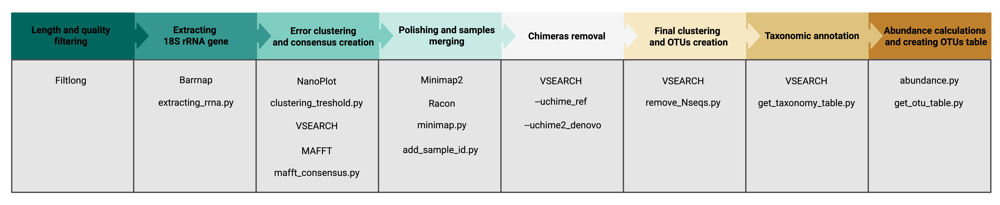

# BaNaNA - Barcoding Nanopore Neat Annotator

<p align="center"></p>  

BaNaNA is a Snakemake pipeline designed to create high-quality OTUs (Operational Taxonomic Units) from Oxford Nanopore sequencing of environmental amplicons. The pipeline was optimised for evaluation of general protist diversity based on the 18S rRNA gene; however, it is possible to choose a different rRNA gene, including the 16S rRNA gene. The main version of the pipeline was optimised for Kit 14 Nanopore chemistry, though a separate description of the approach for Kit 9 chemistry is available. 

Scheme of the pipeline:




<!--- TOC START -->
Table of Contents
-----------------
- [Installation and setting up the pipeline](#installation-and-setting-up-the-pipeline)
- [Download PR2 database](#download-pr2-database)
- [Configure BaNaNA](#configure-banana)
- [Run BaNaNA](#run-banana)
- [Run BaNaNA for the Kit 9 chemistry](#run-banana-for-the-kit-9-chemistry)
- [Cite BaNaNA](#cite-banana)
<!--- TOC END -->


## Installation and setting up the pipeline

### 1. Check for conda channels

First, make sure that your conda has the `conda-forge` and the `bioconda` channels added.  

```
conda config --show channels
```

If they are missing add them with the following commands:

```
conda config --add channels conda-forge
conda config --add channels bioconda
```

Make sure that you ***don't*** have the channel priority set to `strict`.


### 2. Install Snakemake in a separate conda environment

```
conda create -c conda-forge -c bioconda -n snakemake snakemake
```

### 3. Download the repository

Download the repository to your preferred location using `git`:

```
git clone https://github.com/ibe-uw/BaNaNA.git
```

### 4. Create a folder in which all the analysis will be performed and make the python scripts executable

```
cd BaNaNA
mkdir samples
chmod a+x scripts/*
```

## Download PR2 database

We recommend using PR2 database (https://pr2-database.org) for taxonomic assignment of 18S rRNA gene. The pipeline was optimised to use with UTAX version of the database - `pr2_version_x.y.z_SSU_UTAX.fasta` (https://github.com/pr2database/pr2database/releases). 


## Configure BaNaNA

Adjust the run for your specific case by modifying options in the `config.yaml` file. ***The exemplary config file is located in the `suppl` folder.***

* `sample_name`: Provide names of you samples.

The name should only contain `-` sign (make sure you avoid `_` sign as well). Also, they need to be the same as the names of the FASTQ files. For example, if your files are `BAB10.fastq` and `MIK3.fastq`, then the `sample_name` option should look like this:

```
sample_name:
 - BAB10
 - MIK3
```

* `threads`: Number of threads to use by the pipeline. 
* `min_len_filtering`: Lower threshold for your amplicon length filtering. 
* `max_len_filtering`: Upper threshold for your amplicon length filtering. 
* `rrnas`: Your amplicons may be longer than 18S rRNA gene and contain multiple rRNA genes (like 5.8S rRNA and 28S rRNA for eukaryotes). Specify all rRNA genes included in your whole amplicon and their minimal length contained in the amplicon.

If your amplicon contains three genes, this option should look like this:

```
rrnas: 18S_rRNA:1000,5_8S_rRNA:90,28S_rRNA:400
```

And if you amplicon contains only 18S rRNA gene, this option should look like this:

```
rrnas: 18S_rRNA:1000
```

* `chosen_rrna`: Specify which rRNA gene, included in the `rrnas` option you want to keep for futher analysis. Choose only one gene, ***the default one is `18S_rRNA` gene***.
* `db_location`: Provide absolute path to the reference database you want to use to assign the taxonomy with.
* `db_id`: Specify minimal identity of OTUs to the closest reference sequence for taxonomic annotation. ***Default is `0.7`***.
* `db_query_cov`: Specify minimal coverage of OTUs to the closest reference sequence for taxonomic annotation. ***Default is `0.9`***.
* `enable_optional_taxonomy_format`: It's an optional step applied only for the PR2 database UTAX version (look ***Download PR2 database*** chapter), which creates a tab-separated table from raw VSEARCH output. If you are using a different database than PR2 or a different version of PR2 database, set this option to `false`.

Other options can be modified if needed.


## Run BaNaNA

### 1. Copy your basecalled and demultiplexed FASTQ files to the folder `samples`

***The file configuration is important***. Your BaNaNA folder should look like this:

```
BaNaNA
├── Snakefile
├── config.yaml
├── envs
├── files
├── imgs
├── LICENSE
├── README.md
├── samples
|   ├── BAB10.fastq
|   └── MIK3.fastq
├── scripts
└── suppl
```

### 2. Activate snakemake conda environment

```
conda activate snakemake
```

### 3. Create necessary conda environments and install softwares

This is an optional step, as the environments set up during the proper run, however we recommend it, to check if all the environments install properly.

```
snakemake --use-conda --conda-create-envs-only
```

### 4. Run the analysis

This command will run the pipeline for all the samples provided in the `sample_name` option.

***The pipline takes 77 minutes to finish one sample of 279552 sequences on 8 threads.*** 

```
snakemake --configfile config.yaml --use-conda
```

### 5. Find the final output

The piepline creates a folder `final` and places there all four final output files:
* `otus.fasta` - final OTUs sequences
* `otu_table.tsv` - table of abundance of each OTU in each sample
* `taxonomy.tsv` - taxonomy of each OTU directly from VSEARCH
* `taxonomy_table.tsv` - taxonomy of each OTU in a form of a TSV table (created based on `taxonomy.tsv`)


## Run BaNaNA for the Kit 9 chemistry

The main pipeline is optimised for the Kit 14 chemisty. If you wish to run it for the Kit 9 chemistry you need to replace the main `Snakefile` with the `Snakefile` from the `suppl` folder. The Kit 9 version instead of clustering based on average error of the sample performs the first clustering at 80% identity.  


## Cite BaNaNA

If you are using our pipeline, please cite this repsoitory:

Chwalińska M, Karlicki M, Karnkowska A. (2025) BaNaNA - Barcoding Nanopore Neat Annotator. Accessible online: https://github.com/ibe-uw/BaNaNA


